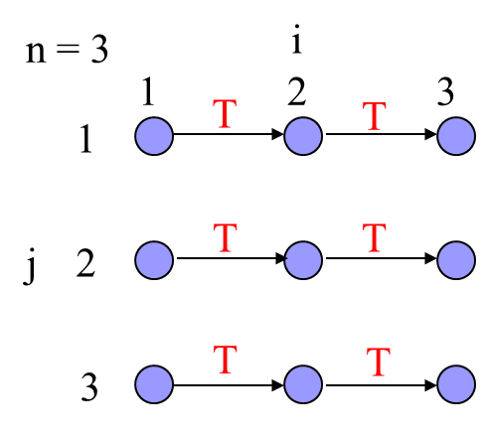

# PROBLEM SET 6

## _Zhiqiang Xie_ 77892769

### Problem 1

Dependences:

- $S_1[i,j] \rightarrow T\space S_1[i+1,j]$
- $S_1[i,j] \rightarrow A\space S_2[i,j]$

LGD:



Parallel algorithm:

- No dependences between different $j$, which is the way to parallelize.

```c
#pragma omp parallel for private(i) schedule(static) 
for (j=1; j<=n; j++)
    for (i=1; i<=n; i++) {
        S1: a[i][j] = a[i-1][j] + b[i][j];
        S2: b[i][j] = c[i][j]
    }
```

### Problem 2

Dependences:

- $S_1[i] \rightarrow T\space S_1[i+1]$
- However, it can be formulated like: $a[i] = 0 + 1 + 2 + ... + i = (1+i)*i/2$

```c
a[0] = 0;
#pragma omp parallel for schedule(static)
for (i=1; i<=n; i++)
    a[i] = (1+i)*i/2;
```

### Problem 3

Dependences:

- $S_1[i] \rightarrow T\space S_1[i+1]$
- $S_2[i] \rightarrow T\space S_2[i+1]$
- $S_2[i] \rightarrow T\space S_1[i+1]$

It's suitable to deploy the reduction diagram:

```c
double sum = 0.0;
double sign;
#pragma omp parallel for reduction(+:sum) private(sign) schedule(static) 
for (i = 0; i < n; i++) {
    sign = 1;
    if (i%2 != 0){
        sign = -1;
    }
    sum += sign/(2*i+1);
}
pi = 4.0*sum;
```

### Problem 4

Refer from this [notes](http://web.mst.edu/~ercal/387/Suppl/class-Sort.txt) for the whole proof:

> ```
> In 2 steps:
>
> THEOREM 2.7 : [Knuth's 0/1 Principle] 
> ============  If a sorting algorithm that performs only element
> comparisons and exchanges sorts all sequences of zeroes and ones then
> it sorts all sequences of arbitrary numbers. 
>
> proving 		SORTS ALL 0/1 s  ====> SORTS ANY SEQUENCE
>
> is = to proving   CAN NOT SORT A SEQUENCE ====> CANNOT SORT ALL 0/1s
>
> PROOF:
> ------ Let f be a monotonic function: x <= y  ======> f(x) <= f(y)
>
> Obviosuly, if a compare/exchange algorithm
>
>  transforms		 (x1,x2,....,xn)  into (y1, y2, ...,yn)
> it also transforms  (f(x1),f(x2),...,f(xn)) into (f(y1),f(y2),...,f(yn))
>
> Suppose that it sorts x to obtain a y sequence where  y(i) > y(i+1) UNSORTED
> Define f as : f(x)=0 for x < y(i)  and f(x)=1 for x >= y(i)
> Then the algorithm transforms the 0/1 sequence (f(x1),f(x2),...,f(xn)) 
> into the 0/1 sequence
>       (f(y1),f(y2),...f(yi),f(y[i+1])...,f(yn)) which is NOT SORTED. 
>
>          0  ....    0  1      0      1 .. 1
> 
>
> Comments by Mark Allen on the conditions for a sorting 
> algorithm to be called a "comparison-based sorting algorithm": 
> -----------------------------------------------------------------
> As far as the 0/1 proof, I think the conditions on a "comparison
> based sorting algorithm" would be the following (These conditions
> should be sufficient, and although I don't prove it I'm quite
> confident I can write a counter-example program if you try to
> weaken them much):
>
> 1.) The only two operations which can be used to modify the
>     data in the array are
>     a.) compare and exchange, and
>     b.) swap (unconditionally).
> 2.) For the logical expression that direct the flow of control
>     in our program, we can use any kind of logical expression,
>     as long as this expression does not vary with the contents
>     of the array.
>
>     "Contents" meaning the value of A[0], A[1], .., and A[n-1].
>     So the number of elements in the array, n, is fair game to
>     use in our logical expressions.
>
> The goal of these conditions would be that given an array and a
> non-decreasing function f, the algorithm performs all the exact
> same swaps, on elements of the array x1,x2,..,xn as it does on the
> array f(x1),f(x2),..,f(xn), or if it does not perform some swap on
> say f(xi) and f(xj) where it did on xi and xj, it is because
> f(xi)==f(xj).
>
> Another desirable result of these conditions is that (since the
> flow of control is unrelated to the contents of the array) two
> arrays of equal size get sorted in the same ammount of time.
>
> The first condition is obvious.  It is what we have been saying the
> whole time.  The only two operations which can be used to modify
> the data in the array are
>   1.) compare and exchange
>   2.) swap (unconditionally)
> By the way, the compare and exchange operation may test for <, <=,
> >, >=, or == between the two array elements in making its decision
> of whether or not to exchange those two elements.
>
> The second condition is less obvious and I've never heard it
> stated when people discuss comparison based sorting algorithms,
> but it is just as important.  We must restrict what kinds of
> logical expressions can be used to alter the flow of control.
> [Eg. the logical expressions in "if" and "while" statements.]
>
> The condition is that we can make any kind of logical expression
> we want as long as neither expression varies with the contents of
> the array.
>
> Note: this condition implies in particular that we may NOT use
> array elements in comparisons that are related to the flow of
> control of the program (even if _both_ elements are array
> elements).  The ONLY time such comparisons happen is inside a
> "compare exchange" command.
>
> To see the problem if we allow comparisons between elements of the
> array to be used in an if statement, here is an example of such a
> program that contradicts the 0/1 principal:
>
> Make a couple loops that go through comparing all possible pairs
> of array elements, and keeps track of whether any of them have
> equal values.
>   If (we find _any_ two elements that are equal OR
>       the array has only one or two elements) then
>     we say "ah, I like this array, I'll sort it correctly."
>     next we sort using some legitimate sorting algorithm
>   else
>     we say "nope, I think I'll just output garbage this time."
>   endif
> End of algorithm.
>
> Note that the first condition of this "if" statement will always
> evaluate true when we do a sequence of 0's and 1's.  So it will
> always sort these correctly, but it will not do all arbitrary
> sequences.
>
> The problem is that the condition in the "if" statement varies
> with the contents of the array.
>
> I just wanted to point this out because I consider it quite
> dangerous to oversimplify what it means for an algorithm to
> be comparison based.
>
> I don't mean to overcomplicate it either.  If we wanted to do
> that we could write a grammar that generates all legitimate
> comparison based algorithms :) .  It wouldn't be too
> informative though, I don't think.
> ```

A straightforward OpenMP example:

```c
for(phase = 0; phase < N; phase++) {
    if(phase & 1){
        #pragma omp parallel for private(i) shared(arr)
        for(i = 2; i < N; i+=2)
            if(arr[i-1] > arr[i])
                swap(&arr[i-1],&arr[i]);
    } else {
        #pragma omp parallel for private(i) shared(arr)
        for(i = 1; i < N; i+=2)
            if(arr[i-1] > arr[i])
                swap(&arr[i-1],&arr[i]);
    }
}
```

